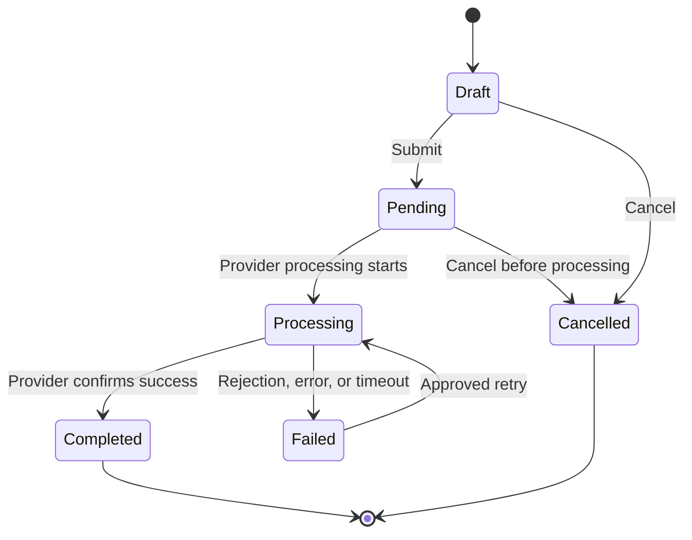
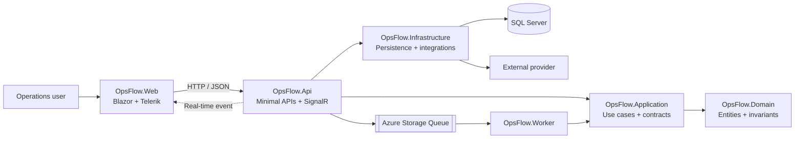
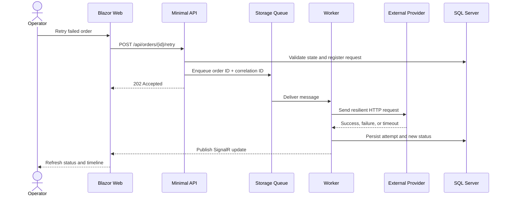
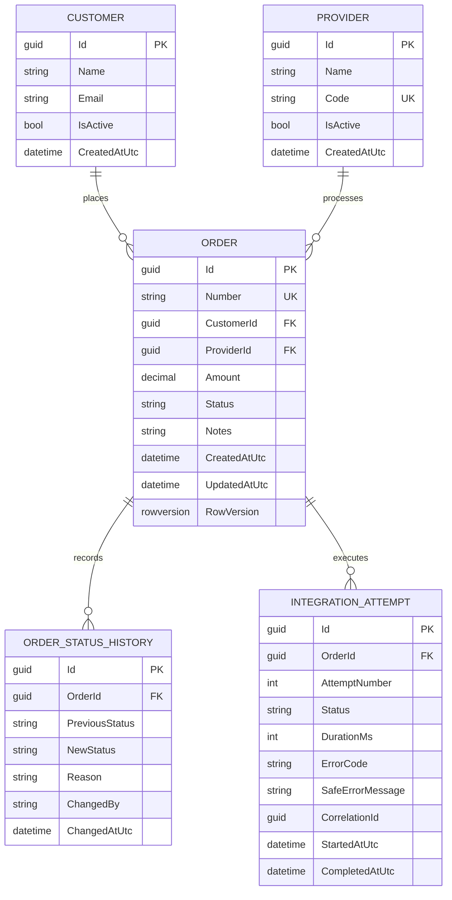

<div align="center">

# OpsFlow

### Enterprise order operations with resilient integrations and real-time visibility

[](https://dotnet.microsoft.com/)
[](https://dotnet.microsoft.com/apps/aspnet/web-apps/blazor)
[](https://www.telerik.com/blazor-ui)
[](https://www.microsoft.com/sql-server)
[](https://www.docker.com/)

**A full-stack engineering case study focused on enterprise UX, operational reliability, and complete feature ownership.**

[Product](#product) · [Business Rules](#business-rules) · [Architecture](#architecture) · [Data Model](#data-model) · [Technology Stack](#technology-stack)

</div>

---

## Product

OpsFlow is an enterprise operations platform for managing orders submitted to external service providers. It gives operations teams a single place to find an order, understand its current state, inspect its complete history, correct eligible information, and safely recover failed integrations.

The product replaces fragmented operational work across spreadsheets, logs, provider portals, and manual database queries with a clear, traceable, and action-oriented workflow.

## Current implementation status

The backend vertical slice is operational and ready for the Blazor frontend:

- domain-owned order lifecycle, audit history, retry eligibility, and idempotency;
- Minimal API endpoints for orders, customer/provider lookups, and dashboard metrics;
- SQL Server persistence with EF Core migrations, deterministic seed data, indexes, constraints, and `rowversion` concurrency;
- transactional outbox, Azure Storage Queues, Azurite, bounded delivery retries, and poison-queue handling;
- separate Worker process with resilient HTTP calls to controlled success, rejection, transient-failure, and timeout scenarios;
- SignalR update relay after persisted Worker results;
- consistent `ProblemDetails`, correlation IDs, liveness/readiness checks, Dockerfiles, and Docker Compose;
- unit, integration, API-contract, concurrency, queue, and end-to-end SignalR tests.

The current development focus is the Blazor/Telerik experience. Authentication and policy authorization, Serilog/Seq, and production deployment hardening remain explicit later-stage work rather than completed features.

### Core user journey

1. Find orders using search, advanced filters, sorting, and server-side pagination.
2. Create or edit an order through a structured business form.
3. Inspect customer, provider, amount, status history, and integration attempts.
4. Submit the order to a simulated external provider.
5. Understand whether processing succeeded, failed, or timed out.
6. Retry an eligible integration without creating duplicate processing.
7. Receive the resulting status update in real time without refreshing the page.

## Project focus

OpsFlow is designed to demonstrate ownership of a business feature from interface design through delivery. The project gives equal attention to what users see and what makes the workflow reliable behind the interface.

| Focus area | Engineering evidence |
|---|---|
| Enterprise frontend | Responsive Blazor screens, visual hierarchy, dense data presentation, and accessible interaction states |
| Component design | Reusable Razor components and consistent design tokens without unnecessary abstractions |
| Advanced data UI | Customized Telerik Grid, server operations, filters, templates, forms, dialogs, and dashboards |
| Backend contracts | Minimal APIs, DTOs, validation, dependency injection, middleware, and consistent HTTP semantics |
| Business rules | Centralized order transitions, retry eligibility, concurrency protection, and audit history |
| Data engineering | Relational modeling, transactions, indexes, execution plans, and optimized read paths |
| Distributed workflows | SignalR, background processing, queues, retries, idempotency, and cancellation |
| Production readiness | Structured logs, health checks, containers, tests, and failure diagnostics; authentication remains planned |

## Business rules

### Orders

- Every order belongs to exactly one customer and one provider.
- Each order number is unique and acts as its external business identifier.
- New orders can reference only active customers and active providers.
- The order amount must be greater than zero.
- Business data can be edited only while the order is in an eligible state.
- Completed and cancelled orders are immutable through the regular editing workflow.
- Concurrent updates are protected by SQL Server `rowversion`; stale writes are rejected instead of silently overwriting newer data.

### Status lifecycle



- Status transitions are validated in the domain layer and cannot be bypassed by manipulating the UI or HTTP request.
- Every accepted transition creates an immutable history entry with previous status, new status, reason, actor, and UTC timestamp.
- Terminal states do not accept normal transitions.
- The UI shows only allowed actions, while the API independently enforces the same rules.

### Integration attempts

- A retry is allowed only for an order whose latest processing result is recoverable.
- An order cannot have more than one active integration attempt at the same time.
- Repeated retry requests use an idempotency strategy to prevent duplicate processing.
- Every provider call records its attempt number, duration, result, correlation ID, and safe error details.
- Provider credentials, raw sensitive payloads, and internal stack traces are never exposed to operators.
- A timeout is recorded as an explicit processing outcome and never treated as confirmed success or failure without evidence.
- Status notifications are published only after the resulting database transaction is committed.

### Authorization

| Role | Capabilities |
|---|---|
| Viewer | View dashboards, orders, histories, and integration attempts |
| Operator | Viewer capabilities plus create, eligible edit, and retry actions |
| Administrator | Operator capabilities plus auxiliary data and access administration |

Authorization is enforced by backend policies. Hiding a button is a usability decision, not a security boundary.

## Product experience

### Operations dashboard

- total, processing, failed, and completed-order metrics;
- success rate and provider-performance indicators;
- order-volume chart by period;
- recent orders and items requiring attention;
- explicit loading, empty, error, and degraded-service states.

### Orders workspace

The primary interface is a customized `TelerikGrid` built for operational work rather than generic CRUD.

- debounced text search;
- filters by status, customer, provider, date, and amount range;
- server-side sorting and pagination;
- custom cells for status, customer identity, money, and contextual actions;
- saved Grid preferences and clear-filter behavior;
- keyboard navigation, visible focus, accessible labels, and responsive layouts;
- non-blocking loading, empty, no-results, and error feedback.

### Create and edit experience

- logically grouped fields inside a customized Telerik dialog;
- appropriate selectors for customers and providers;
- formatted monetary input;
- field-level and business-level validation;
- duplicate-submission protection;
- confirmation before discarding unsaved changes;
- clear success, validation, conflict, and unexpected-error feedback.

### Order details

- order identity, current status, and allowed actions;
- customer, provider, amount, and relevant timestamps;
- chronological status timeline;
- integration-attempt table;
- safe technical failure information and correlation ID;
- guarded retry action with processing state;
- live updates through SignalR.

## Architecture

OpsFlow uses a layered architecture that keeps domain rules independent from the interface, HTTP transport, persistence, and external providers.



### Solution structure

```text
OpsFlow/
├── src/
│   ├── OpsFlow.Web/             # Blazor UI and HTTP/SignalR clients
│   ├── OpsFlow.Api/             # Minimal APIs, middleware, and SignalR hub
│   ├── OpsFlow.Application/     # Use cases, validation, and contracts
│   ├── OpsFlow.Domain/          # Entities, invariants, and status rules
│   ├── OpsFlow.Infrastructure/  # SQL Server, repositories, and providers
│   └── OpsFlow.Worker/          # Queue-based background processing
├── tests/
│   ├── OpsFlow.UnitTests/
│   └── OpsFlow.IntegrationTests/
├── docs/
├── docker-compose.yml
├── PLAN.md
└── README.md
```

### Architectural principles

- Razor components coordinate presentation and user interaction, not business rules.
- API contracts use dedicated request and response DTOs instead of persistence entities.
- The Application layer defines use cases and ports without depending on UI or infrastructure.
- The Domain layer owns invariants and valid order-state transitions.
- Infrastructure implements persistence, queue, and provider contracts.
- Relevant asynchronous operations propagate `CancellationToken`.
- Database changes and their audit records are handled transactionally.
- Real-time messages are emitted only after durable state changes.
- Logs contain diagnostic context without secrets or unnecessary personal information.

## Asynchronous processing



The workflow is designed around at-least-once message delivery. Consumers must therefore be idempotent and capable of handling duplicate messages, bounded retries, poison messages, provider timeouts, and worker restarts during processing.

## Data model



### Indexing strategy

- unique index on `Orders.Number`;
- unique index on `Providers.Code`;
- composite index on `Orders(Status, CreatedAtUtc)`;
- composite index on `Orders(ProviderId, Status)`;
- composite index on `Orders(CustomerId, CreatedAtUtc)`;
- unique composite index on `IntegrationAttempts(OrderId, AttemptNumber)`.

Indexes are justified against real filtering, ordering, and lookup patterns. Query performance is evaluated with actual execution plans and measured before-and-after evidence rather than assumptions.

## API surface

| Method | Endpoint | Responsibility |
|---|---|---|
| `GET` | `/api/orders` | Paginated, filtered, and sorted order search |
| `GET` | `/api/orders/{id}` | Order details, history, and integration attempts |
| `POST` | `/api/orders` | Create a new order |
| `PUT` | `/api/orders/{id}` | Update an eligible order with concurrency protection |
| `POST` | `/api/orders/{id}/retry` | Request idempotent reprocessing |
| `GET` | `/api/customers` | Customer lookup data |
| `GET` | `/api/providers` | Provider lookup data |
| `GET` | `/api/dashboard/summary` | Operational metrics |

Example Grid request:

```http
GET /api/orders?page=1&pageSize=25&search=acme&status=Processing&providerId=3&sort=-createdAtUtc
```

Example paginated response:

```json
{
  "items": [],
  "page": 1,
  "pageSize": 25,
  "totalCount": 0
}
```

The API uses consistent `ProblemDetails` responses and meaningful HTTP semantics:

- `400 Bad Request` for invalid input;
- `403 Forbidden` for unauthorized actions;
- `404 Not Found` for missing resources;
- `409 Conflict` for invalid state or optimistic-concurrency conflicts;
- `202 Accepted` when asynchronous processing is registered successfully.

## Run the backend

Requirements: Docker Desktop and the .NET 10 SDK.

1. Copy `.env.example` to `.env` and replace the placeholder with a strong local SQL Server password. The `.env` file is ignored by Git.
2. Start the reproducible backend environment:

   ```powershell
   docker compose up -d --build
   ```

3. Verify the API, SQL Server, and queue readiness:

   ```powershell
   Invoke-WebRequest http://localhost:5153/health/ready -UseBasicParsing
   ```

4. Run the automated test suite:

   ```powershell
   dotnet test OpsFlow.sln
   ```

5. Stop the environment without deleting the persistent volumes:

   ```powershell
   docker compose down
   ```

The API is available at `http://localhost:5153`. Local non-container development uses SQL Server LocalDB and Azurite on ports `10000`–`10002`.

## Technology stack

| Area | Technology | Responsibility |
|---|---|---|
| Runtime | .NET 10 and C# | Application platform and language |
| Frontend | Blazor Web App | Interactive component-based UI |
| Component library | Telerik UI for Blazor | Enterprise grids, forms, dialogs, charts, and navigation |
| Styling | HTML, CSS, Bootstrap, and scoped CSS | Responsive layout and visual system |
| API | ASP.NET Core Minimal APIs | HTTP contracts, middleware, `ProblemDetails`, health checks, and SignalR hosting |
| Validation | FluentValidation | Request and business-input validation |
| Persistence | SQL Server and Entity Framework Core | Relational data, transactions, and concurrency |
| Real time | SignalR | Live order and processing updates |
| Background processing | `BackgroundService` | Queue consumption and provider workflows |
| Messaging | Azure Storage Queues and Azurite | Durable asynchronous processing in cloud and local environments |
| HTTP resilience | `Microsoft.Extensions.Http.Resilience` | Timeouts, retries, circuit handling, and resilient provider calls |
| Observability | Built-in structured logging and health checks | Current diagnostics and service visibility |
| Containers | Docker and Docker Compose | Reproducible local infrastructure |
| Testing | xUnit | Unit and integration verification |

## Reusable UI system

The interface uses design tokens for color, typography, spacing, borders, elevation, and motion. Light and dark themes preserve hierarchy and accessible contrast.

Core Razor components include:

- `PageHeader`
- `MetricCard`
- `OrderStatusBadge`
- `OrderFilterPanel`
- `OrderTimeline`
- `IntegrationAttemptGrid`
- `EmptyState`
- `LoadingState`
- `MoneyDisplay`
- `ConfirmActionDialog`

Components are introduced when they encode reusable behavior or a visual rule. Thin wrappers that only rename Telerik components are intentionally avoided.

## Reliability and observability

- structured application and infrastructure logging;
- correlation ID propagation across Web, API, queue, Worker, and provider requests;
- start, completion, duration, and safe failure-category logs for every attempt;
- health checks for API, SQL Server, queue, and essential dependencies;
- retry with exponential backoff and a defined attempt limit;
- poison-queue handling for definitive failures;
- provider timeouts and cooperative cancellation;
- explicit diagnostics for container startup, networking, configuration, and dependency failures.

## Security baseline

- validation of every state-changing command;
- protection against overposting and unbounded queries;
- external error responses without stack traces or sensitive provider details;
- secrets supplied through environment variables, Secret Manager, or managed identity;
- no passwords, tokens, Telerik license material, or real connection strings in source control;
- logs designed to avoid credentials and unnecessary personal data.

Authentication and policy-based authorization are planned before any production deployment. They are not represented as a completed security boundary in the current portfolio build.

## Testing strategy

| Scope | Current coverage |
|---|---|
| Domain tests | Valid and invalid transitions, invariants, retry eligibility, idempotency, and terminal states |
| Application/infrastructure tests | Query validation, filtering, sorting, cancellation, and Azurite queue creation |
| End-to-end backend tests | API contracts, SQL Server concurrency, `ProblemDetails`, retry processing, timeout, and SignalR delivery |
| Frontend tests | Planned alongside the Blazor forms, details, dashboard, and reconnecting states |

## Engineering principles

- Prefer a complete vertical slice over disconnected technical demonstrations.
- Make failure states understandable and recoverable for the user.
- Treat accessibility, responsiveness, and visual feedback as product requirements.
- Protect reads and writes at the backend boundary.
- Measure SQL and runtime performance before optimizing.
- Introduce queues, resilience, and observability to solve concrete workflow risks.
- Keep commits focused, documentation explicit, and local execution reproducible.
- Never store credentials, private package-feed secrets, or licensed artifacts in the repository.

---

<div align="center">

**OpsFlow — turning complex operational failures into clear, safe, and observable workflows.**

</div>
